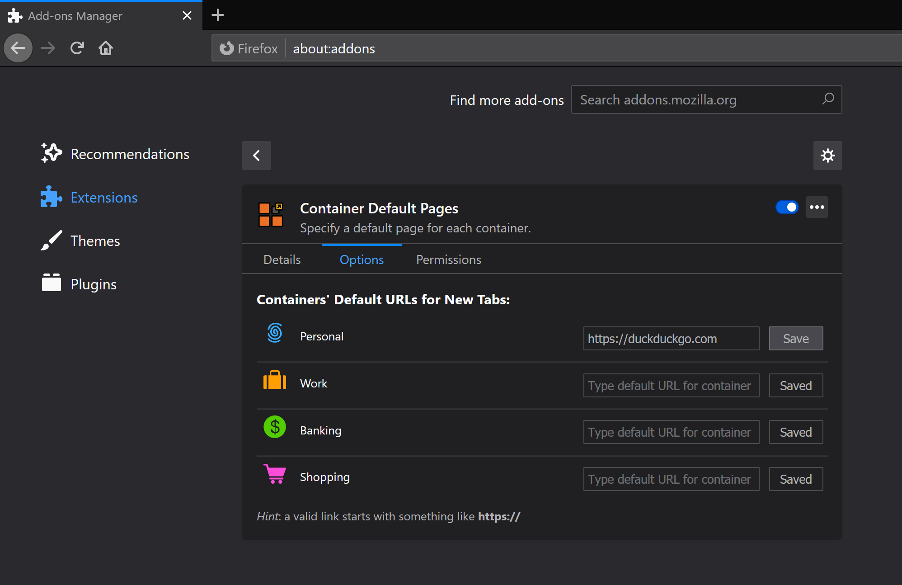

# FF-Container-Default-Pages
This is a Firefox browser extension that lets you specify a default page for each container.

Containers allow you to isolate different environments.

One common use case is to have containers for specific sites, sometimes even a single website. So, it would make sense that when you open a tab in that container, it should conveniently default to that specific site. This extension does just that; gives you the option of assigning containers their own pages to default to. If you love containers, you’re gonna love this too!

## Usage:

You can download and install the extension from the Mozilla Addon store [here](https://addons.mozilla.org/en-US/firefox/addon/container-default-pages/)

To set default pages, go to the extension’s options page, which should look similar to this screenshot except it will list *your* containers instead.

You see a list of all your existing containers along with URL input boxes for default pages. Just type your URL next to a container and press “Save”. Now, every time you open a new tap in that container, it will automatically open the URL to that website.

You may have been using the [MAC (Multi Account Containers)](https://addons.mozilla.org/en-US/firefox/addon/multi-account-containers/) extension by Firefox. One thing it does is allow you to assign a website to always open in a specific container. This, on the other hand, gives the extra feature of allowing you to assign a container itself to a default website. This extension is compatible with MAC and other container extensions. You can also use it without other extensions. Only thing you need is to have containers enabled.

Since this sets a default page, then it will not be compatible with other extensions that alter your default page. Sometimes this may take over, other times others will take over, no guarantees. So, it is best to have one thing that sets your default page.

## Privacy:
Extension does not collect any usage information. The only information stored are URLs you input, and they are stored locally. This extension does not send any information whatsoever.

## Learn more about containers:
https://wiki.mozilla.org/Security/Contextual_Identity_Project/Containers